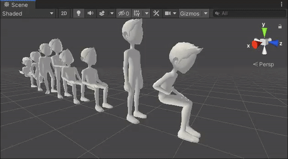

# GPU Animation 🎠

This package helps baking skinned mesh animations for animating on the GPU and thus using instanced rendering features.

Currently supports builtin rendering only

## How To Use 💡
Please open the <a href="https://github.com/needle-tools/gpu-animation/tree/main/package/README.md">Package Readme</a> for more information.

## Contact ✒️
<b>[🌵 needle — tools for unity](https://needle.tools)</b> • 
[@NeedleTools](https://twitter.com/NeedleTools) • 
[@marcel_wiessler](https://twitter.com/marcel_wiessler) • 
[@hybridherbst](https://twitter.com/hybridherbst)
